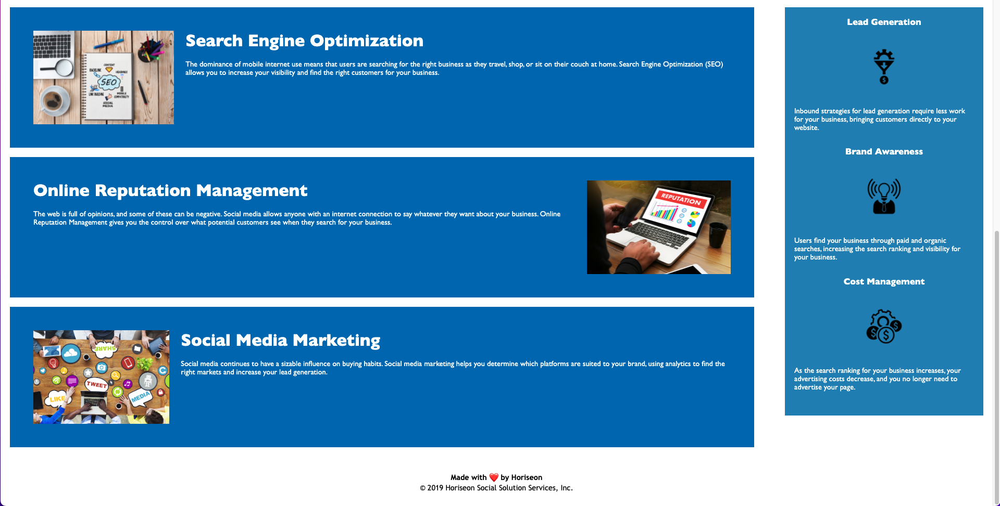

## Code-refactor

Summary: I have completed the necessary changes that the acceptance criteria asked for and completed the grading rubric requirements. During this challegne I did come across some difficulties. A couple things that really tripped me up were relating to semantic HTML elements and structure independence of styling and positioning. During this time I did review past modules, reach out to my academic advisor, and AskBCS to get more educated on these topics and it helped a lot. I thought this exercise was a great opportunity because it stretched my knowledge and required me to do outside work from what I was already comfortable with. Every day I spent a few hours working and updating the code as it did take some time learning the material. 

URL: https://colinale.github.io/Code-refactor/

Images: )
)